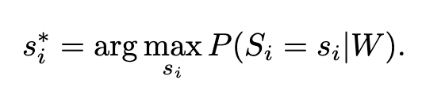
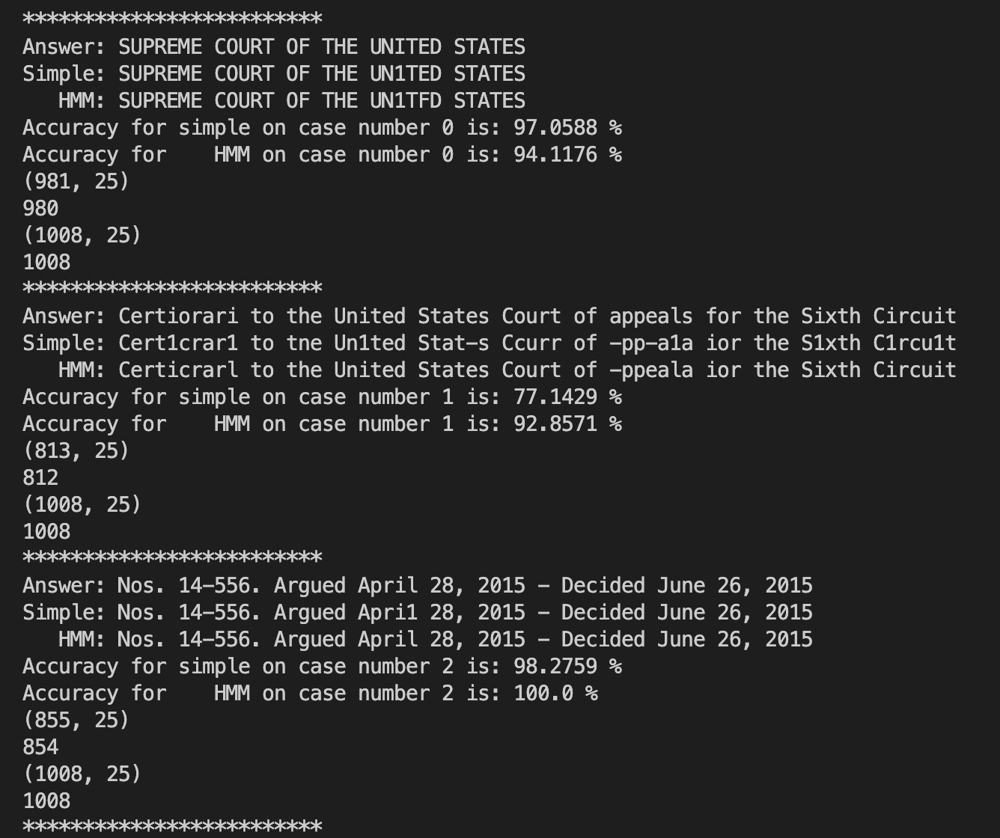
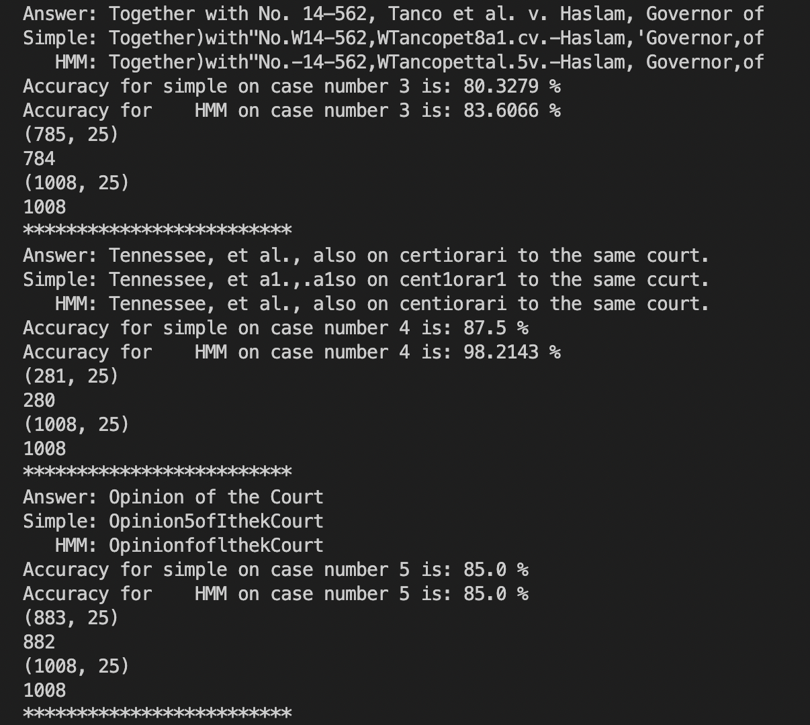
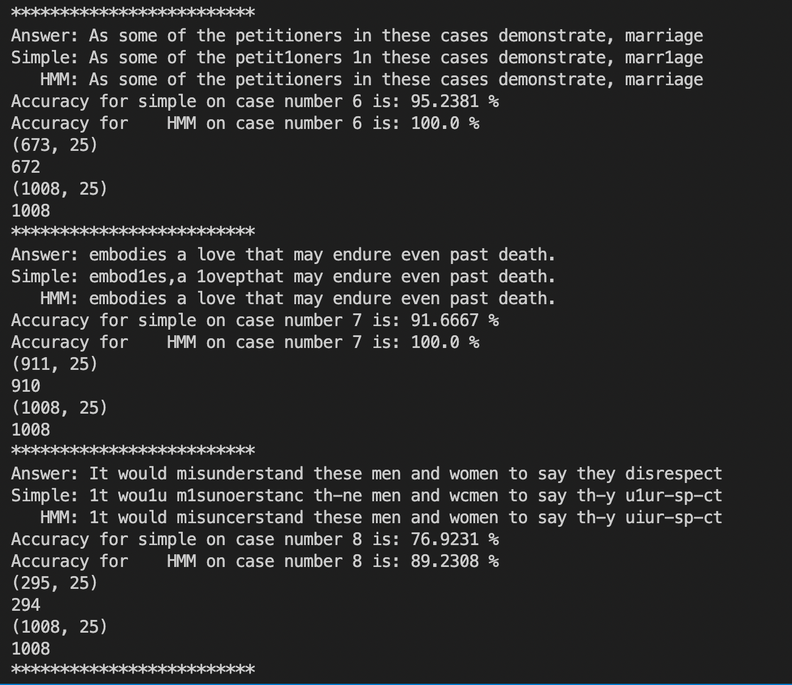
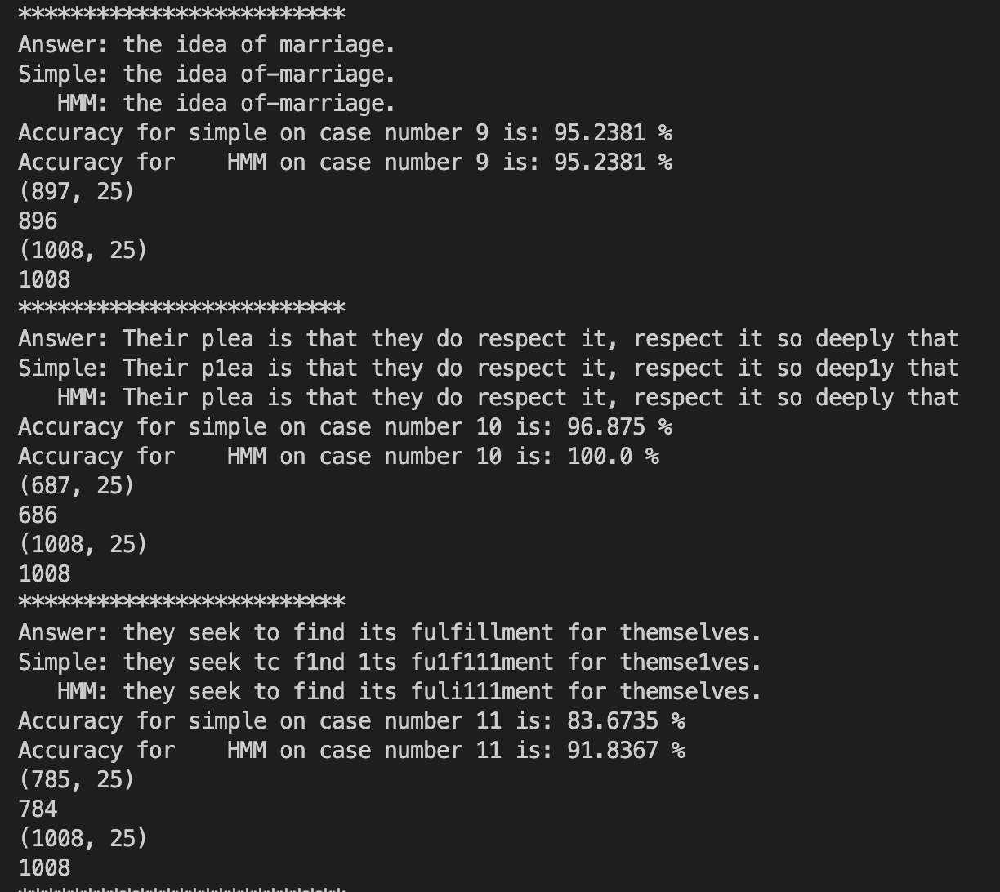
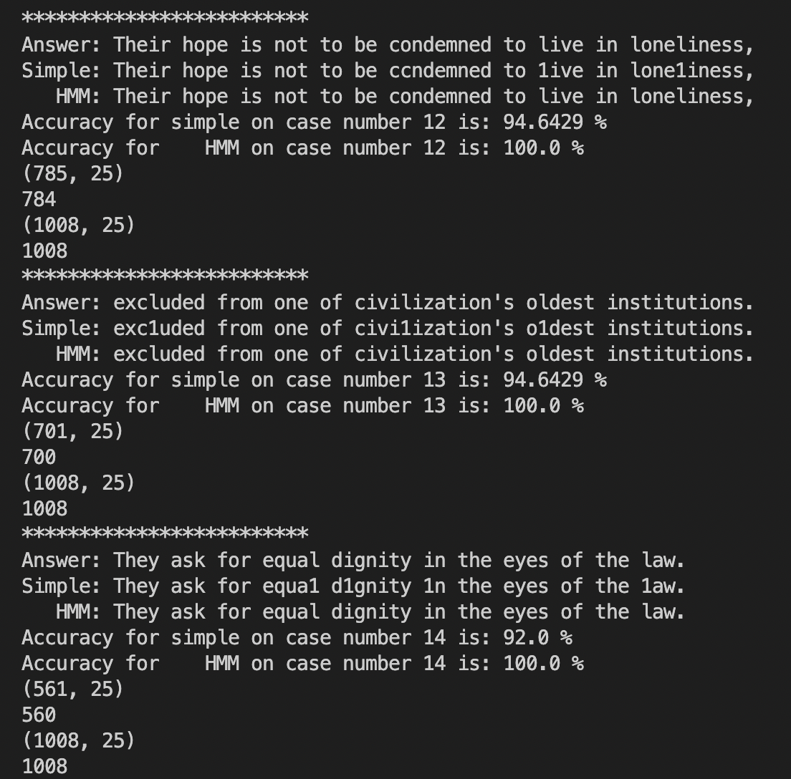
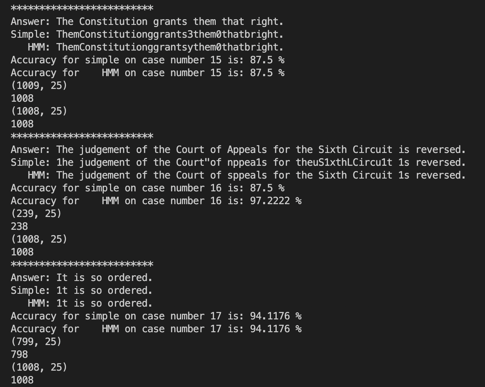
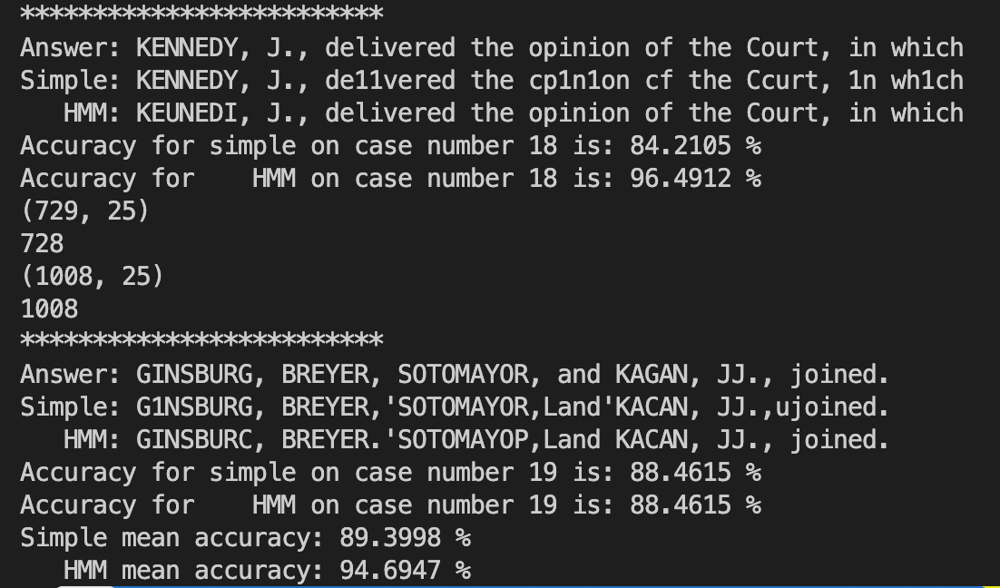

# Optical Character Recognition using Probabilistic Models

Command to run the program:

```{bash}
python3 my_own_test_script.py ./test_images/courier-train.png bc.train ./test_images/test-0-0.png
```


## **Reading Text**

### **Task**

The task is to read the text data from an image, and outupt the data in the form of plain text. It is a typical example of an Optical Character Recognition problem. We are given a set of clean images of each character as a reference, and our task is to match a noisy image with the reference image as closely as possible, and return the closest possible character associated with the noisy character.

### **Approach**

### **Probability measures**

We are given the reference and noisy characters in the form of a mxn matrix, filled with '\*' and ' '. We can convert this matrix into a sparse matrix filled with 0 instead of ' ' and 1 instead of '\*'. I have flattened the matrix for a single pass of a list.

**1) Intersection over Union (IoU)**

We define the probability using IoU over the two flattened noisy and reference lists as follows:
(Defined as probability_2 in the code)

```python
probability_2 = (intersection count + 1) / (union count + 1).
```

**2) Dice Score**

I got this idea from google and wikipedia. Reference: <https://en.wikipedia.org/wiki/S%C3%B8rensen%E2%80%93Dice_coefficient>

My implementation of dice score is a bit modified:
(Defined as probability_3 in the code)

```python
probability_3 = (intersection count + 1) / (number_of_1s_in_reference + number_of_1s_in_noisy + 1)
```

In both the probabilistic measures, I have added + 1 to the numerator and denominator, in order to avoid log(0) or 0/0 errors.

### **Simple**

The noisy character (a_bar) and the reference character (a) are said to be similar if there is a maximum probability P such that P(noisy/reference) is maximum.

Hence for every character in the noisy sentence, we look through the entire reference set and then return the refernce character with the highest probability of P(noisy/reference).

Example: We are given a noisy a (a_bar). We do not know beforehand what it looks like. Hence we maximize the following: (From the problem statement).



In our example, W can be defined as any reference character between [A-Za-z0-9(),.-!\'\"]

S in our example is the noisy character a_bar.
If the noisy character image is close to a known refernce character image, it outputs the plain text character associated with the reference pixels. Hence it outputs the answer as plain text character 'a', since 'a' is the most similar to a_bar.

However, this might not always be the case. For example, a noisy C (C_bar) could be more closer to 'G' than 'C'. Hence the model may output G as the answer, where a human might read it as a C given the image itself and the context of the letter.

The probability measure used for this problem is **Intersection over Union (IoU).**

### **Hidden Markov Model (HMM)**

We can define initial probabilities, transition probabilities and emission probabilities as follows:

1) Initial probabilities: The probability of a character occuring at the start.
    - Go through the train_file.txt supplied in the command line argument.
    - Count the frequency of each character and then divide it by the sum of frequencies to get the probability for each character.
    - Reduce the initial frequency of a space being the first character, since it is not likely to happen. In my case, I have divided its frequency by a thousand.
    - Divide the initial probability of each character by the sum of frequencies to obtain a probability measure.
    - Store the natural logarithm of this value and return the probability table.

2) Transition probabilities: The probability of the sentence having current character as c1 and next character as c2.
    - Create a nested dictionary where c1 is the key and the value is a dictionary. Let's call the value dictionary as temp_dict.
    - Now, the temp_dict contains c2 as the key and the value is the count of having c2 after c1 in the training set.
    - Divide the value each temp_dict with the sum of the values of the temp_dict to get the probability.
    - Go through the train_file.txt supplied in the command line argument.
    - Initialized the counts in each temp_dict as 0.0001 instead of 0, since it could cause a log error.
    - Store the natural logarithm of this value and return the probability table.

3) Emission probabilities: The probability that the characters of the train and test image are similar. It is a grid of probabilities where there is a probability for every character in the test images given the train images.
    - Create a nested dictionary where the state state_1 is the key and the value is a dictionary. Let's call the value dictionary as temp_dict.
    - Now, the temp_dict contains obs_1 as the key and the value is the probability that the state state_1 is similar to obs_1. The probability is calculated between state_1 and obs_1.
    - In this case, we are using the **Dice score**.
    - Store the natural logarithm of this value and multiply it by 50 (a random factor obtained through trial and error), so that the transition probabilities do not dominate the emission probabilities. Return this table.

HMM primarily balances two goals: maximizing the transition and emission probabilities. The viterbi algorithm code is taken from the solution provided for the in-class activity 2 on Oct 20, 2021. There is a slight modification though. Since we are calculating the natural logarithm for each of the probabilities, we maximize over the sum of transition and emission probabilities instead of the product.

## Results

We have typed out the actual answer by reading from the test images (human input). These strings are the expected answers.
Accuracy is measured as follows:
Accuracy = (Number of characters matched between the output and the expected answer) / (Total number of characters in the expected answer).

The below output can be achieved using the following command:

```bash
python3 my_own_test_script.py ./test_images/courier-train.png ../part1/bc.train ./test_images/test-0-0.png
```

Overall accuracy for simple model is **89.39%**
Overall accuracy for Hidden Markov Model is **94.69%**








